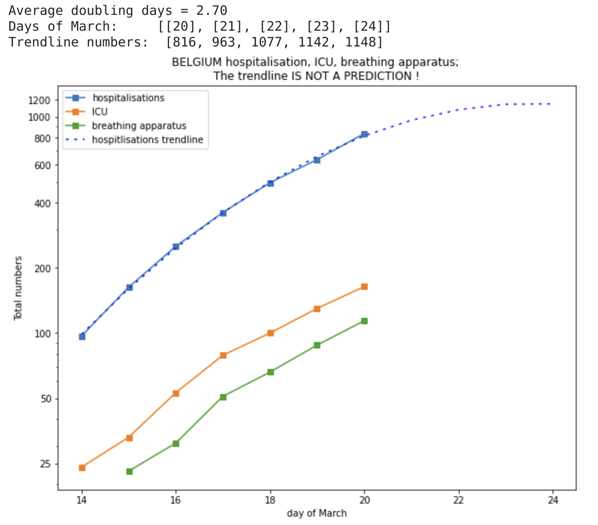

# Plots of covid19 hospitalisations on logarithmic scale and trending.

First Notebook is on https://colab.research.google.com/drive/1O7kH5sxu36atNYDavtEuw4Vw8Wq0SpUW#scrollTo=SER7lP_Rcc39

First plots of these data are on https://twitter.com/peter_v around 18, 19, 20 March 2020.

Please collaborate with comments, PR, forked Notebooks.

Most needed now is data on:

* hospitalisations
* ICU
* breathing apparatus

in different European countries (particularly The Netherlands).

## Why

The reason for these graphs are:

* number of _confirmed cases_ are by definition an underestimation and are dependent on testing _policy_ !
* number of hospitalisations, ICU, breathing apparatus is far less dependent on policy and also has a much harder real-world impact.

The graphs are _logarithmic_ because:

* initially, there is exponential growth ("viral")
* what is the rate of growth (e.g. doubling time) ?
* plotting on _log_ scale shows this as a _straight line_
* shows bending down when the growth rate slows down
* on linear graph, not easy to see that

I am very curious (and worried also) about how the different approach of "hammer and dance" vs. "herd immunity" will affect these numbers and potentially overload of the medical system.

Maybe the trendline can be somewhat of an earlier indicator for the next days ??
The trendline *IS NOT A PREDICTION* !
